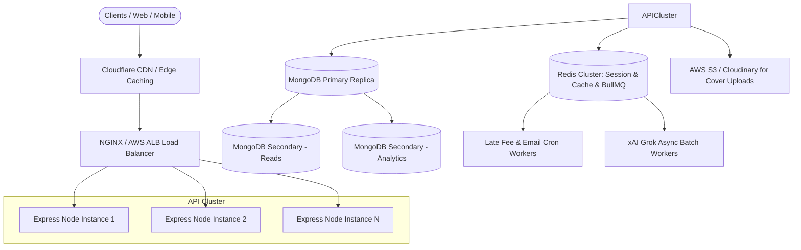

# 🏛 Rentify — Architecture & System Design Interview Guide

> This comprehensive technical guide details the high-level architecture, low-level design patterns, concurrency controls, security models, and scalability strategies implemented in **Rentify**. It is structured specifically for technical deep-dives, code reviews, and system design interviews.

---

## 📑 Table of Contents
1. [Core Architecture & Component Layout](#1-core-architecture--component-layout)
2. [Concurrency Control: Preventing Double-Booking Race Conditions](#2-concurrency-control-preventing-double-booking-race-conditions)
3. [Financial Integrity & Razorpay Cryptographic Verification](#3-financial-integrity--razorpay-cryptographic-verification)
4. [Platform-Aware Grok AI: Context Injection & Security Isolation](#4-platform-aware-grok-ai-context-injection--security-isolation)
5. [Real-Time Executive Analytics via MongoDB Aggregation Pipelines](#5-real-time-executive-analytics-via-mongodb-aggregation-pipelines)
6. [Recommendation Engine & Cold-Start Strategy](#6-recommendation-engine--cold-start-strategy)
7. [Caching Tier & Pattern-Based Invalidation](#7-caching-tier--pattern-based-invalidation)
8. [Preservation of Legacy Architecture](#8-preservation-of-legacy-architecture)
9. [Production Scaling Blueprint (From Monolith to High-Scale)](#9-production-scaling-blueprint-from-monolith-to-high-scale)

---

## 1. Core Architecture & Component Layout

### Clean Separation of Concerns
Rentify follows a layered enterprise service architecture:
- **Routes Layer (`/routes`)**: Defines endpoint schemas, HTTP verbs, and applies targeted middleware (`rateLimit`, `protect`, `requireAdmin`, `optionalAuth`).
- **Controllers Layer (`/controllers`)**: Manages HTTP request/response lifecycles, parses params, extracts validated payloads, and formats standardized JSON envelopes (`{ success: true, ... }`).
- **Services Layer (`/services`)**: Houses all domain business logic, cryptographic operations, state machines, and database queries. Ensures zero controller-to-database tight coupling.
- **Models Layer (`/models`)**: Defines strict Mongoose schemas with compound indexes, text indexes, pre-save hooks, and helper methods (`matchPassword`).

```
rentify/
├── client/                      # React 18 + Vite Frontend
│   ├── src/
│   │   ├── components/          # Reusable UI Atoms & Molecules (Navbar, BookCard, CartDrawer, etc.)
│   │   ├── context/             # Global Contexts (Auth, Cart, Wishlist, Notifications, Toast)
│   │   ├── pages/               # Route Pages (Home, BookDetail, CartCheckout, AdminDashboard, etc.)
│   │   └── index.css            # Tailwind + Custom Design Tokens (Plus Jakarta Sans, Glassmorphism)
│   └── vite.config.js           # Vite configuration with `/api` proxy
└── server/                      # Node.js + Express API
    ├── config/                  # DB connection and environment loader
    ├── controllers/             # HTTP boundary handlers
    ├── middleware/              # Authentication, admin validation, rate-limiting, error handling
    ├── models/                  # Mongoose domain entities (Book, BookCopy, Rental, Payment, etc.)
    ├── routes/                  # Express routers
    ├── services/                # Concurrency, Payments, Recommendations, Grok AI, Inventory
    ├── tests/                   # Automated Jest test suites (Concurrency, Payments, Auth, Recs)
    └── utils/                   # Database seeder and helpers
```

---

## 2. Concurrency Control: Preventing Double-Booking Race Conditions

### The Problem
In physical book rentals, multiple users may click "Rent Now" at the exact same millisecond for the final physical copy of a popular book (`availableCopies: 1`). Naive implementations check `if (book.availableCopies > 0)` in memory, followed by `book.availableCopies -= 1; await book.save();`. Under high concurrent load, this causes a Classic Time-of-Check to Time-of-Use (TOCTOU) race condition resulting in negative inventory and double-allocated books.

### The Solution: Atomic Conditional Updates
Instead of heavy, slow pessimistic table locks or two-phase commit transactions that degrade throughput, Rentify uses **MongoDB Conditional Atomic Decrements**:

```javascript
// server/services/rentalService.js
const book = await Book.findOneAndUpdate(
  {
    _id: item.bookId,
    availableCopies: { $gt: 0 } // ATOMIC CONDITIONAL GUARD
  },
  {
    $inc: {
      availableCopies: -1,
      rentalCount: 1
    }
  },
  { new: true }
);

if (!book) {
  // If no document matched, stock became 0 immediately before this execution.
  // Abort transaction and offer FIFO waiting list reservation.
  throw new Error(`Sorry, "${item.title}" just went out of stock.`);
}
```

### Physical Copy Allocation (`BookCopy`)
Once the atomic guard confirms availability, the system allocates a discrete physical barcode copy (`BookCopy` model):
```javascript
const copy = await BookCopy.findOneAndUpdate(
  {
    book: item.bookId,
    status: 'AVAILABLE'
  },
  {
    status: 'RENTED',
    currentRental: rental._id
  },
  { new: true }
);
```

### BookMyShow-Style FIFO Waiting List
If a book is completely rented out, users can join a FIFO Reservation queue (`Reservation` model). When an admin processes a return or a copy becomes available, the system marks the reservation as `CLAIMABLE` and reserves the physical copy for a **24-hour window**, alerting the user via real-time notifications.

---

## 3. Financial Integrity & Razorpay Cryptographic Verification

### Never Trust the Client Rule
A common vulnerability in ecommerce platforms is trusting totals sent from the frontend:
`POST /api/checkout { totalAmount: 10 }` — users can tamper with request payloads in dev tools.

In Rentify:
1. **Server-Side Price Recomputation**: The client only sends `{ bookId, rentalDays }`. The backend queries the database for `rentalPrice` and `securityDeposit`, computing:
   $$\text{Subtotal} = \sum (\text{Book Rental Price} \times \lceil\text{Days} / 7\rceil)$$
   $$\text{Grand Total} = \text{Subtotal} + \sum \text{Security Deposit}$$
2. **Cryptographic HMAC-SHA256 Verification**:
   When Razorpay completes payment on the client, it returns:
   - `razorpay_order_id`
   - `razorpay_payment_id`
   - `razorpay_signature`

   The backend recalculates the HMAC signature using the server's private secret:
   ```javascript
   // server/services/paymentService.js
   const expectedSignature = crypto
     .createHmac('sha256', process.env.RAZORPAY_KEY_SECRET)
     .update(`${orderId}|${paymentId}`)
     .digest('hex');

   if (expectedSignature !== signature) {
     throw new Error('Payment verification failed: Invalid cryptographic signature.');
   }
   ```
3. **Replay Attack Defense**:
   Before updating rental states, the server checks if `razorpay_payment_id` has already been recorded in the `Payment` ledger. If seen previously, the transaction is rejected immediately.
4. **Deposit Lifecycle**:
   Security deposits are tracked separately from rental fees. Upon return:
   - **GOOD**: 100% deposit refunded.
   - **DAMAGED**: 50% deposit deducted for repairs/replacement.
   - **LOST**: 100% deposit forfeited.

---

## 4. Platform-Aware Grok AI: Context Injection & Security Isolation

### Architecture
Rentify integrates the official **xAI Grok API** (`https://api.x.ai/v1/chat/completions`) using the `grok-beta` / `grok-2` model family, augmented with an in-process intelligent fallback simulator for zero-downtime offline evaluation.

### Context Enrichment Pipeline
When a user chats with Grok, the backend dynamically prepares sanitized domain context:
1. **Active Rentals & Due Dates**: Grok knows what books the user has borrowed and how many days remain before late fees accrue.
2. **Catalog Highlights**: A sampled view of popular categories and trending titles is provided for recommendation queries.
3. **Rental Policies**: Pre-configured platform knowledge (rental duration periods, late fees of ₹10/day, 100% deposit refund policy).

```javascript
// server/services/grokService.js
// Context sanitization: Pass only relevant metadata, never tokens or IDs
const sanitizedRentals = userRentals.map(r => ({
  title: r.book?.title,
  dueDate: r.dueDate ? new Date(r.dueDate).toLocaleDateString() : 'N/A',
  status: r.status
}));
```

### Security & Privacy Isolation
- **Prompt Injection Defense**: User queries are strictly assigned to `role: 'user'`, while platform knowledge and behavioral boundaries are enforced in `role: 'system'`.
- **Zero Credential Leakage**: Database ObjectIDs, hashed passwords, JWT secrets, and gateway API keys are never included in the prompt payload.
- **Rate Limiting**: AI endpoints are rate-limited to 20 queries per 15 minutes per IP to prevent API quota exhaustion.

---

## 5. Real-Time Executive Analytics via MongoDB Aggregation Pipelines

Instead of loading thousands of documents into Node.js memory and using JavaScript `.reduce()` (which causes high CPU load, heap fragmentation, and memory leaks), Rentify executes all financial metrics directly inside the MongoDB database engine using multi-stage aggregation pipelines:

```javascript
// server/controllers/adminController.js
const revenueStats = await Rental.aggregate([
  {
    $group: {
      _id: null,
      totalRevenue: { $sum: '$rentalFee' },
      totalDepositsHeld: {
        $sum: {
          $cond: [{ $eq: ['$status', 'ACTIVE'] }, '$securityDeposit', 0]
        }
      },
      totalLateFees: { $sum: '$lateFee' },
      totalRentals: { $sum: 1 }
    }
  }
]);

// Category-wise Rental Distribution
const categoryStats = await Rental.aggregate([
  {
    $lookup: {
      from: 'books',
      localField: 'book',
      foreignField: '_id',
      as: 'bookDetails'
    }
  },
  { $unwind: '$bookDetails' },
  {
    $group: {
      _id: '$bookDetails.category',
      count: { $sum: 1 },
      totalRevenue: { $sum: '$rentalFee' }
    }
  },
  { $sort: { count: -1 } }
]);
```

**Why this matters in an interview**:
- Demonstrates database-level optimization and index utilization (`$lookup`, `$unwind`, `$group`).
- Constant memory footprint in the Node.js API process regardless of platform dataset size.

---

## 6. Recommendation Engine & Cold-Start Strategy

### Similarity Scoring Matrix
The recommendation engine (`recommendationService.js`) computes a weighted content-based similarity score between books:
- **Category Match**: Weight = 4.0
- **Author Match**: Weight = 3.0
- **Shared Tags**: Weight = 1.5 per overlapping tag
- **Rating Bonus**: Weight = `averageRating * 0.5`

### Cold-Start Mitigation
When a user is unauthenticated or has zero rental history:
1. The engine falls back to a **Trending & Popularity Index**:
   $$\text{Score} = (\text{rentalCount} \times 0.6) + (\text{averageRating} \times \log_{10}(\text{numReviews} + 1) \times 10)$$
2. High-scoring books are returned with a 15-minute TTL cache, preventing repetitive database aggregations for new visitors.

---

## 7. Caching Tier & Pattern-Based Invalidation

Rentify incorporates an in-memory TTL caching service (`cacheService.js`) with Redis-compatible semantics:
- `catalog:*` — Caches paginated search and filter results (TTL: 5 minutes).
- `book:*` — Caches individual book details and copy status (TTL: 10 minutes).
- `recommendations:*` — Caches trending and user recommendations (TTL: 15 minutes).

### Write-Through Invalidation
When an inventory mutation occurs (e.g. checkout, book update, return inspection):
```javascript
// Invalidate all book and catalog cache entries
cacheService.delPattern('catalog:*');
cacheService.del(`book:${bookId}`);
cacheService.delPattern('recommendations:*');
```
This ensures zero stale inventory states while maintaining lightning-fast read operations for browsing users.

---

## 8. Preservation of Legacy Architecture

A key enterprise requirement was transforming the application without breaking existing functionality:
- **Preserved Peer-to-Peer Exchange**:
  - Maintained `server/models/Listing.js` and `Request.js`.
  - Maintained Express endpoints `/api/listings` and `/api/requests`.
  - Maintained client pages `AddListing.jsx`, `MyListings.jsx`, `ListingDetail.jsx`.
- **Integrated Navigation**:
  - The navigation bar includes a direct gateway to "Study Exchange", enabling students to both rent commercial catalog books and exchange peer study materials under a unified authentication system.

---

## 9. Production Scaling Blueprint (From Monolith to High-Scale)

If scaling Rentify to 100,000+ daily active users:



1. **Distributed Caching**: Replace in-memory `cacheService` with a Redis Cluster.
2. **Read/Write Splitting**: Route catalog queries (`GET /api/books`) to MongoDB Secondary read-replicas, keeping the Primary replica dedicated to atomic checkouts and payments.
3. **Asynchronous Background Jobs**: Offload daily late-fee accrual, email notifications, and reservation expiry checks to BullMQ workers running on Redis.
4. **Media CDN**: Store high-resolution book cover images on AWS S3 or Cloudinary with WebP edge compression.
5. **Horizontal Container Scaling**: Deploy the Express backend inside Docker containers managed by Kubernetes or AWS ECS with automated CPU-based autoscaling.
