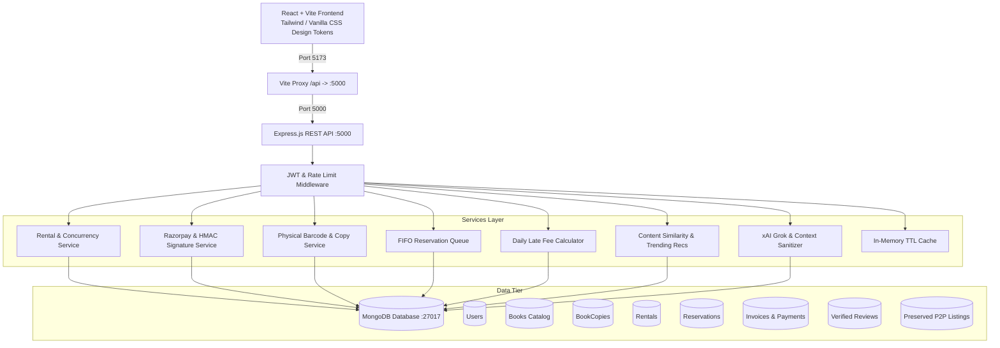

# 📚 Rentify — Production-Grade Intelligent Book Rental Platform

> An enterprise-grade, full-stack MERN application transforming traditional book exchange into a high-concurrency, intelligent commercial rental ecosystem featuring automated inventory allocation, Razorpay cryptographic verification, BookMyShow-style reservations, and a platform-aware xAI Grok assistant.

---

## 🌟 Key Highlights & Engineering Features

1. **Amazon-Grade Catalog & Discovery**
   - Debounced multi-attribute search over titles, authors, categories, and tags.
   - Price range slider, 5-star rating filter, real-time availability filters, and multi-sort criteria (popularity, rating, rental price, newest).
   - Dynamic catalog pagination with responsive skeleton loading states.

2. **Concurrency-Safe Inventory Engine**
   - Prevents double-booking race conditions when multiple users attempt to rent the final physical copy simultaneously.
   - Atomic conditional updates (`{ _id: bookId, availableCopies: { $gt: 0 } }` with `$inc: { availableCopies: -1 }`) coupled with discrete physical barcode copy tracking (`BookCopy`).
   - BookMyShow-style FIFO reservation waiting lists for out-of-stock titles with 24-hour claim windows.

3. **Financial Security & Payment Verification**
   - Integrated with Razorpay payment gateway with built-in development sandbox fallback.
   - Server-side cryptographic HMAC-SHA256 signature verification preventing client-side price tampering or forged transaction payloads.
   - Replay attack defense via stored payment transaction tracking.
   - Full security deposit lifecycle: 100% refundable on returned books in GOOD condition, automated assessment for DAMAGED or LOST copies.
   - Serialized, itemized GST-compliant invoice generation with printable modal and PDF export layout.

4. **Intelligent Platform Assistant (Grok AI / xAI)**
   - Context-aware virtual librarian powered by official xAI Grok API (`https://api.x.ai/v1`) with robust local fallback heuristics.
   - Platform context injection: answers questions regarding user's active rentals, return dates, platform policies, and personalized catalog recommendations while strictly sanitizing sensitive credentials and database IDs.
   - Interactive suggested prompt chips, markdown message rendering, and conversational memory.

5. **Content-Based Recommendation Engine**
   - Multi-factor similarity scoring analyzing shared genres, authors, tags, and user rental history.
   - Intelligent cold-start fallback highlighting trending and top-rated titles for new visitors.

6. **Verified Reader Reviews & Social Proof**
   - Verified Reader badges awarded exclusively to users with completed rental history for the specific title.
   - Real-time rating aggregation and community review moderation reporting.

7. **Admin Executive Analytics Dashboard**
   - High-performance multi-stage MongoDB aggregation pipelines computing total platform revenue, active rental volume, overdue book metrics, and category revenue distribution.
   - Rental return inspection desk allowing admins to evaluate returned copy condition (`GOOD`, `DAMAGED`, `LOST`) and automatically process refundable deposits.
   - Physical copy manager and review moderation queue.

8. **Backward Compatibility & Preserved Features**
   - Seamlessly preserves original peer-to-peer study resource listings (`/api/listings`, `/api/requests`, `AddListing.jsx`, `MyListings.jsx`).

---

## 🏗 System Architecture



---

## 🚀 Quick Start Guide

### Prerequisites
- **Node.js**: v18.0 or higher
- **MongoDB**: Local MongoDB instance running on `mongodb://localhost:27017/rentify` (or MongoDB Atlas URI)
- **npm**: v9.0 or higher

### 1. Backend Setup
```bash
cd rentify/server
npm install

# Optional: Configure custom environment variables in server/.env
# PORT=5000
# MONGO_URI=mongodb://localhost:27017/rentify
# JWT_SECRET=your_jwt_secret
# RAZORPAY_KEY_ID=your_razorpay_key (sandbox fallback active if omitted)
# RAZORPAY_KEY_SECRET=your_razorpay_secret
# GROK_API_KEY=your_xai_key (intelligent local simulator active if omitted)

# Seed Catalog with 18 Books, Copies, Reviews & Admin Accounts
node utils/seedBooks.js

# Run Automated Test Suite
npm test

# Start Server
npm run dev
# or: node server.js
```

### 2. Frontend Setup
```bash
cd rentify/client
npm install

# Start Vite Development Server
npm run dev

# Or build production bundle
npm run build
```

---

## 🔑 Pre-Configured Demo Credentials

| Role | Email | Password | Permissions |
| :--- | :--- | :--- | :--- |
| **Admin** | `admin@rentify.com` | `admin123` | Full Admin Dashboard, Revenue KPIs, Return Inspection, Copy Manager |
| **Admin / User** | `manshi@gmail.com` | `password123` | Admin & Rental privileges, Active Rentals, Peer Listings |
| **Test User** | *Register any new user* | *your choice* | Standard User Discovery, Cart, Checkout, Wishlist, Reviews |

> **Tip**: The Login screen includes one-click demo login buttons to instantly pre-fill credentials for testing.

---

## 📡 Core API Reference

### Authentication (`/api/auth`)
- `POST /api/auth/register` — Create new customer or admin account.
- `POST /api/auth/login` — Authenticate and receive signed JWT.
- `GET /api/auth/profile` — Get current user profile and delivery address.
- `PUT /api/auth/profile` — Update address, phone, and name.
- `PUT /api/auth/change-password` — Secure password update.
- `POST /api/auth/forgot-password` — Trigger password reset token.
- `POST /api/auth/reset-password/:token` — Reset password with token.

### Catalog & Inventory (`/api/books`)
- `GET /api/books` — Paginated search, category/price/rating filters, sorting.
- `GET /api/books/:id` — Single book details with copy inventory status and reviews.
- `POST /api/books` — Admin: Create new catalog title with auto-synced physical copies.
- `PUT /api/books/:id` — Admin: Update book details.
- `DELETE /api/books/:id` — Admin: Remove book and associated copies.
- `GET /api/books/:id/copies` — Admin: List individual physical copy barcodes and condition.

### Rental Engine & Concurrency (`/api/rentals`)
- `POST /api/rentals/checkout` — Atomic concurrency-safe multi-item rental order creation.
- `GET /api/rentals/my` — Get user's active, overdue, and returned rentals.
- `POST /api/rentals/:id/return` — User initiates return request.
- `POST /api/rentals/reserve/:bookId` — Join FIFO reservation waiting list for out-of-stock titles.

### Payments & Invoicing (`/api/payments`)
- `POST /api/payments/create-order` — Create Razorpay order (or sandbox test order).
- `POST /api/payments/verify` — Cryptographic HMAC-SHA256 signature verification.
- `GET /api/payments/invoice/:rentalId` — Fetch itemized tax & deposit invoice.

### Intelligent Assistant (`/api/ai`)
- `POST /api/ai/chat` — Rate-limited Grok AI conversation with sanitized platform context.

### Content Recommendations (`/api/recommendations`)
- `GET /api/recommendations` — Personalized recommendations based on user history or trending fallback.
- `GET /api/recommendations/related/:bookId` — Related books by genre, author, and semantic tags.

### Admin Dashboard Analytics (`/api/admin`)
- `GET /api/admin/analytics` — MongoDB aggregation metrics (revenue, active volume, category breakdown).
- `GET /api/admin/rentals` — List all platform rentals with filter by status (`ACTIVE`, `RETURN_REQUESTED`, `OVERDUE`, `RETURNED`).
- `PUT /api/admin/rentals/:id/process-return` — Condition inspection (`GOOD`, `DAMAGED`, `LOST`) and deposit settlement.
- `PUT /api/admin/copies/:copyId/condition` — Update physical copy condition and maintenance status.
- `GET /api/admin/users` — List platform users and toggle roles.

### Preserved Peer-to-Peer Study Exchange (`/api/listings`, `/api/requests`)
- `GET /api/listings` — List community peer listings.
- `POST /api/listings` — Create peer book listing.
- `GET /api/listings/:id` — View single peer listing.
- `POST /api/requests` — Request peer listing exchange.

---

## 🧪 Automated Testing

All backend services, authentication flows, payment verifications, concurrency locks, and recommendations are covered with automated Jest/Supertest suites.

```bash
cd rentify/server
npm test
```

### Test Suite Summary
- `tests/auth.test.js` — Registration, login, duplicate email rejection, invalid password handling.
- `tests/rental.concurrency.test.js` — Parallel checkout requests competing for the single final copy of a book; verifies conditional atomic update prevents double booking.
- `tests/payment.test.js` — Razorpay HMAC-SHA256 signature validation, counterfeit signature rejection, and duplicate replay attack blocking.
- `tests/recommendation.test.js` — Content similarity recommendation scoring and cold-start fallback.

**Result**: 4/4 suites passing, 11/11 tests passing.

---

## 🛡 Security & Reliability Standards

- **Zero Trust Frontend**: Prices, deposits, stock counts, and user roles are strictly validated and recomputed server-side.
- **Rate Limiting**: Express rate limiters protect authentication endpoints (`/api/auth/*`) and Grok AI chat endpoints (`/api/ai/*`) from abuse.
- **HTTP Hardening**: Helmet middleware sets secure HTTP headers.
- **Replay Protection**: Cryptographic signature validation combined with unique payment ID tracking ensures transactions cannot be replayed.
- **Context Sanitization**: Platform-aware Grok queries provide catalog and rental context while omitting sensitive tokens, passwords, or personal identifiable information.
